<pre align="center">
██████╗ ██████╗  █████╗ ██╗  ██╗ ██████╗ ████████╗ █████╗ 
██╔══██╗██╔══██╗██╔══██╗██║ ██╔╝██╔═══██╗╚══██╔══╝██╔══██╗
██║  ██║██████╔╝███████║█████╔╝ ██║   ██║   ██║   ███████║
██║  ██║██╔══██╗██╔══██║██╔═██╗ ██║   ██║   ██║   ██╔══██║
██████╔╝██║  ██║██║  ██║██║  ██╗╚██████╔╝   ██║   ██║  ██║
╚═════╝ ╚═╝  ╚═╝╚═╝  ╚═╝╚═╝  ╚═╝ ╚═════╝    ╚═╝   ╚═╝  ╚═╝
Welcome to my GitHub profile.
</pre>

    
    

    
    

